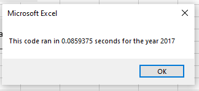
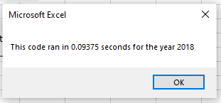

# Stock Analysis with VBA

## Overview of Project

### Purpose

Stock Analysis has been prepared using VBA to avoid manual calculations of provided huge volume of data and increase the speed of obtaining final results. Refactored code was done to decrease time of analysis execution so it can be used for even more volume of data in the future.

## Results

### Stock Performance

VBA code allows to choose the year (2017 or 2018) to provide final results for all companies stocks. To get results for a specific year it is necessary to hit a Run All Stock Analysis button located on a All Stocks Analysis sheet and type the year in a pop-up window. Below code was used to get this window:
```
yearValue = InputBox("What year would you like to run the analysis on?")
```
2017 was a good year for all companies except of TERP - stock return increased for all of them but for TERP we can see a decrease of stock return on 7.2%. As for 2018 only ENPH and RUN show stock return increase - 81.9% and 84.0% accordingly.

Once Stock Analysis has been executed it is very easy to read final results because of formatting. Positive results highlighted with green color and negative - with red after using below code with conditionals and formatting:
```
If Cells(i, 3) > 0 Then
        Cells(i, 3).Interior.Color = vbGreen
    Else
        Cells(i, 3).Interior.Color = vbRed
End If
```

### Execution Time of the Script

Original code was looping final results through all 12 companies - one by one. Considering that on each sheet (2017 and 2018) there are 3012 rows of data it is logical that it takes some time for original script to check all 3012 rows of data for the first company before starting to check the second one.

Since refactored code is looping final results using created tickerIndex once the first company data is over the script starting to collect information for the second company without going through all rows of data separately for each company.

Below screenshots show time that refactored script used to run all stock analysis for 2017 and 2018. These results are 5 times faster than for original code:




## Summary

### What are the advantages or disadvantages of refactoring code?

There are several advantages of code refactoring:
- Increase the speed of VBA script execution;
- Decrease the quantity of code steps;
- Using less memory;
- Making code more logical and easier to read.

### How do these pros and cons apply to refactoring the original VBA script?

Refactoring of the original code successfully made the VBA script run faster - it is now running 5 times faster than original code. Though both codes were executed less or within a second and the difference is not noticeable for current set of data it will become important to save time when making analysis for a way more set of data.
